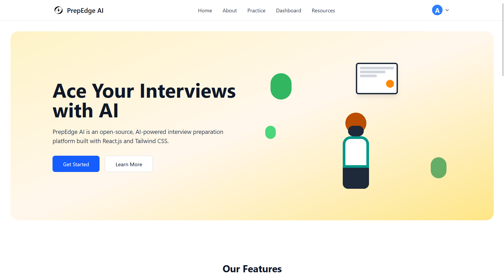
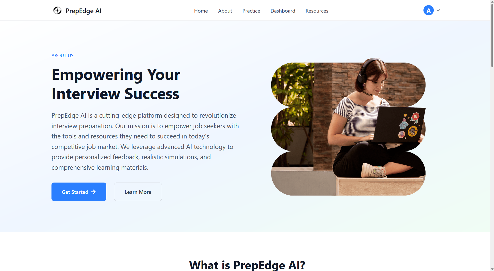
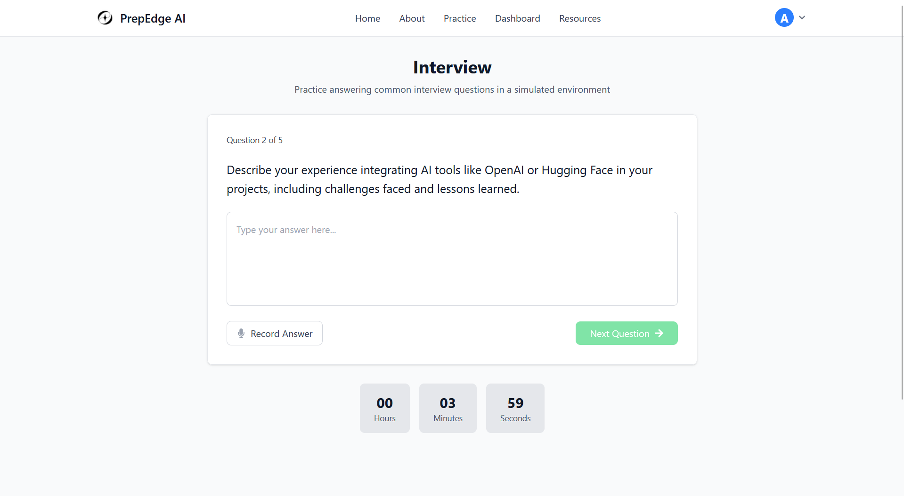
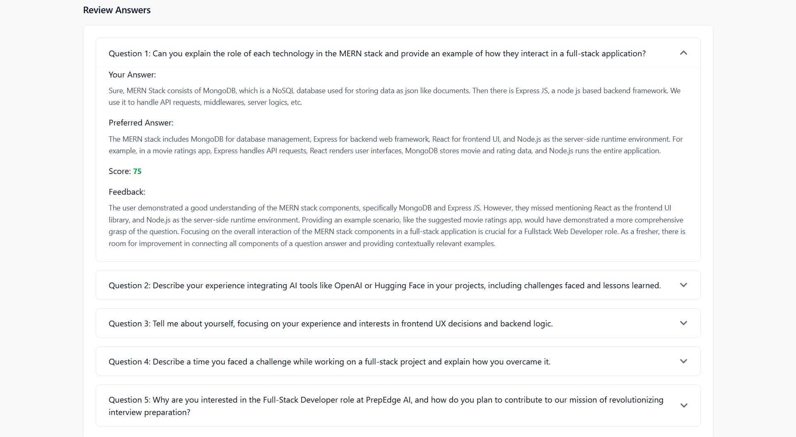
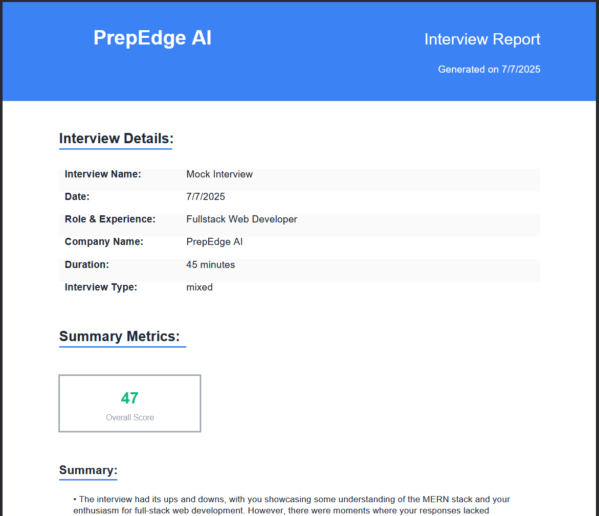
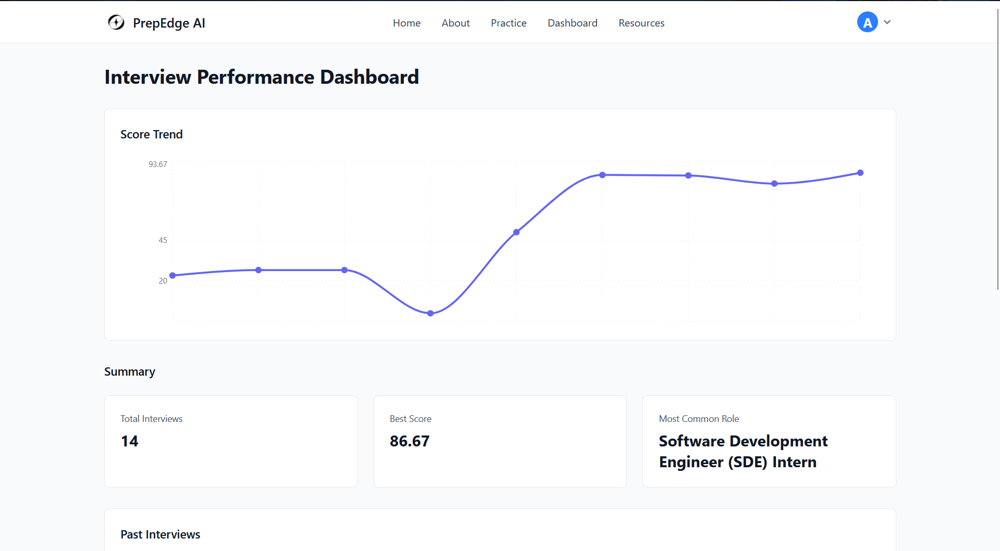
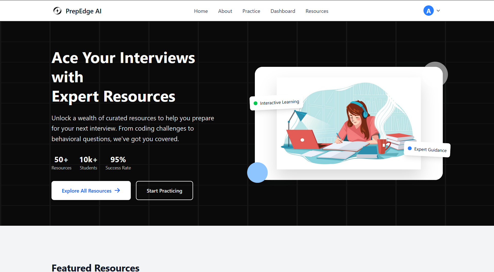

<h1 align="center"> PrepEdge AI </h1>

 An AI enabled smart Interview Preparation Platform 

  🔗 <a href="https://prepedgeai.vercel.app"><b>Live Demo → prepedgeai.vercel.app</b></a>

  

---

<h3><b>📚 Table of Contents </b></h3>
<ol>
  <samp>
    <li> <a href='#introduction'> Introduction </a> </li>
    <li> <a href='#features'> Features </a> </li>
    <li> <a href='#tech-stack'> Tech Stack </a> </li>
    <li> <a href='#demo-screenshots'> Screenshots </a> </li>
    <li> <a href='#contributions'> Contribution </a> </li>
    <li> <a href='#author'> Author </a> </li>
  </samp>
</ol>

---

<h2 id="introduction"> 1. Introduction 👋 </h2>

    <b>PrepEdge AI</b> is a full-stack platform that helps users prepare for job interviews through tailored mock interviews, automatic answer evaluation, and PDF-based reports.

---

<h2 id='features'> 2. Features ✨ </h2>
<ul>
  <samp>
    <li> <b>Personalized Question Generation</b> based on role and experience </li>
    <li> <b>Secure Firebase Authentication</b> for login/signup </li>
    <li> <b>Auto-evaluated Reports</b> with feedback, score, and improvement areas </li>
    <li> <b>PDF Report Generation</b> for downloading performance insights </li>
  </samp>
</ul>

---

<h2 id='tech-stack'> 3. Tech Stack 🛠️ </h2>
<h3><b>Frontend</b></h3>
<ul>
  <samp>
    <li> <a href="https://vitejs.dev/"> <b>Vite</b></a> + <a href="https://react.dev/"> <b>React.js</b></a> with JavaScript </li>
    <li> <a href="https://tailwindcss.com/"><b>Tailwind CSS</b></a> for styling </li>
    <li> <a href="https://firebase.google.com/docs/auth"><b>Firebase</b></a> for authentication </li>
  </samp>
</ul>

<h3><b>Backend</b></h3>
<ul>
  <samp>
    <li> <a href="https://expressjs.com/"> <b>Express.js</b></a> for REST APIs </li>
    <li> <a href="https://www.mongodb.com/atlas/database"> <b>MongoDB Atlas</b></a> as the cloud database </li>
    <li> <a href="https://firebase.google.com/docs/admin/setup"> <b>Firebase Admin SDK</b></a> for token validation </li>
    <li> <a href="https://github.com/expressjs/multer"> <b>Multer</b></a> for file uploads </li>
    <li> <a href="https://huggingface.co/"> <b>Hugging Face APIs</b></a> for AI-enhanced feedback </li>
  </samp>
</ul>

---

<h2 id='demo-screenshots'> 4. Screenshots 📷 </h2>

| Homepage | About Page |
|----------|-------------|
|  |  |

| Interview Setup | Interview Question |
|----------|-------------|
|  |  |

| Interview Report | Report Pdf |
|----------|-------------|
|  |  |

| Dashboard |
|----------|
|  |

| Resources |
|-------------|
|  |

---

<h2 id='contributions'> 5. Contribution 🤝 </h2>

 
    <b> Contributions are Welcome! </b>
     
    If you’d like to improve a feature or fix a bug:
  
    - Fork the repo 
    - Create a new branch (git checkout -b feature-xyz) 
    - Make your changes 
    - Push and open a PR 
    
   ⚠️ Please ensure code is clean, readable, and follows the existing architecture.

---

<h2 id='author'> 6. Author ✍️ </h2>
<h3><samp>Abhinav Mishra – <a href="https://github.com/CoderUzumaki">@CoderUzumaki</a></samp></h3>

---
